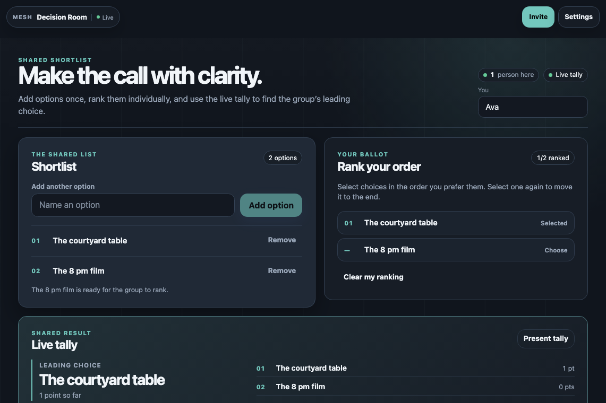
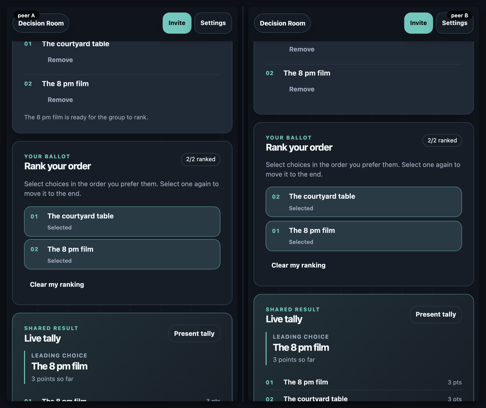

# Decision Room

[](https://baditaflorin.github.io/mesh-decision-room/)
[](https://github.com/baditaflorin/mesh-decision-room/blob/main/package.json)
[](./LICENSE)

Decision Room is a browser-local, peer-to-peer space for making a small group decision. Add a shared shortlist, rank the options in your own order, and see a deterministic Borda tally update for everyone in the room.

**Live:** https://baditaflorin.github.io/mesh-decision-room/



## How it works

1. Add the first real option, or use the starter shortlist.
2. Share the room with the people deciding.
3. Each person ranks the same options in preference order.
4. The shared tally identifies the leading choice without an account or central application database.

The first screen is already the decision workflow: it collects a first option and an optional local name instead of presenting a marketing-only landing page.



## Privacy and rooms

Everything in a room is visible to the people connected to that room: option names, rankings, and optional display names. There are no accounts and no application-owned database. Yjs state exists while peers are connected, and WebRTC carries updates directly between peers when possible.

Read the full [privacy note](docs/privacy.md) before using a room for a sensitive decision.

## Run locally

Decision Room uses the current `mesh-common` checkout as a sibling dependency.

```bash
git clone https://github.com/baditaflorin/mesh-common
git clone https://github.com/baditaflorin/mesh-decision-room
cd mesh-decision-room
npm ci
npm run dev
```

Open the shown local URL in two browser tabs. Give both the same room ID from **Settings**, or use the app’s invite control.

## Verify a change

```bash
npm run fmt:check
npm run typecheck
npm run test:unit
npm run smoke
npm run test:e2e
npm run audit:security
```

GitHub Pages serves the committed `docs/` directory from `main`. `npm run smoke` rebuilds that directory, including the SPA fallback at `docs/404.html`.

## Infrastructure

| Endpoint                               | Purpose                             |
| -------------------------------------- | ----------------------------------- |
| `wss://turn.0docker.com/ws`            | WebRTC signaling fan-out            |
| `https://turn.0docker.com/credentials` | Short-lived TURN credentials        |
| `turn:turn.0docker.com:3479`           | Relay fallback for restrictive NATs |

The Settings drawer lets a person override signaling and TURN endpoints on their own device. Blank or unreachable overrides fall back to STUN-only behavior.

## License

[MIT](./LICENSE)
